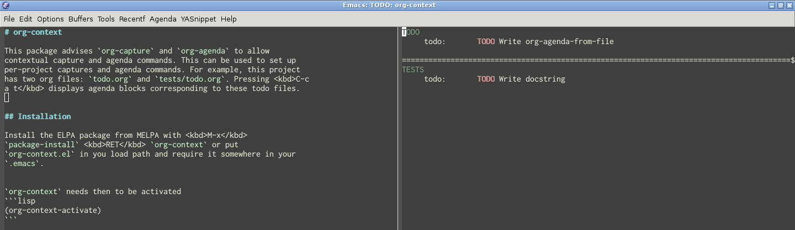

# org-context

This package advises `org-capture` and `org-agenda` to allow
contextual capture and agenda commands. This can be used to set up
per-project captures and agenda commands.

For example, this project has two org files: `todo.org` and
`tests/todo.org`. Pressing <kbd>C-c a t</kbd> in my setup displays
agenda blocks corresponding to these todo files.



## Installation

The package is available on MELPA. To use it, you need then to enable
`org-context-mode`:

```lisp
(org-context-mode +1)
```

## Specific capture templates and agenda commands

Templates or commands are added to the existing ones depending on the
file the buffer is visiting, the buffer name, or the major mode at the
time `org-capture` or `org-agenda` are called.

The capture templates and the agenda commands can be customized in
a global and local way:

- The first way is to use the variable `org-context-capture-alist` for
  contextual capture templates and `org-context-agenda-alist` for
  contextual agenda commands. These variables control specific
  templates and commands in a global way.

- The second way is to use the buffer-local variables
  `org-context-capture` and `org-context-agenda`. They are typically
  set in a `.dir-locals.el` file so as to be local to the directory
  tree.

### Custom captures

The variable `org-context-capture-alist` is an alist of the form
`(CONDITION . TEMPLATE-LIST)` where `CONDITION` is either a major mode
or a regular expression matching a buffer file-name or a buffer name
and `TEMPLATE-LIST` is a list of Org templates.

The buffer-local variable `org-context-capture` is just a template
list like `org-capture-templates`.

#### Short captures templates

Templates are often the same accrosse projects except that they refer
to different Org files. To shorten the definition of templates in
`TEMPLATE-LIST`, `org-context` allows you to write them as:

- `ID`: look up in `org-context-capture-shortcut` or
  `org-capture-templates` with `ID`
- `(KEY ID)` or `(KEY (ID))`: look up in
  `org-context-capture-shortcut` or `org-capture-templates` with `ID`
  but use `KEY` to trigger the template in the dispatch menu
- `(KEY (ID FILE))`: look up in `org-context-capture-shortcut` or
  `org-capture-templates` with `ID` but use `KEY` and change targeted
  Org file to `FILE`
- `(KEY (ID FILE DESC))`: look up in `org-context-capture-shortcut` or
  `org-capture-templates` with `ID` but use `KEY`, change targeted Org
  file to `FILE` and use `DESCRIPTION` in the dispatch menu

The simplest form of shorten template definition is `ID` which can be
either a letter or a symbol. A symbol indicates to look up in
`org-context-capture-shortcut` for a classic template and a letter
indicates to reuse the definition of corresponding template in
`org-capture-templates`.

The trigger key used in the dispatch menu can be overridden by
specifying `KEY`.

If `FILE` or `DESCRIPTION` are specified, they override the targeted
Org file and the description.

If `FILE` is not specified or if it is not an absolute path, it is
expanded against the string matched by `CONDITION` if it is a regex.

For example, we can evaluate this:

``` lisp
(add-to-list 'org-context-capture-alist '("/home/homer/ProjectA" question))
```

which will define a capture template for files in `ProjectA` using the
lookup symbol `question` to look into `org-context-capture-shortcut`.

Valid definitions are for example,

```lisp
(add-to-list
 'org-context-capture-alist
 '("/home/homer/ProjectA"
   question
   ("q" question)
   ("q" (question))
   ("q" (question "blah.org"))
   ("q" (question "blah.org" "Description"))
   "q"
   ("q" "t")
   ("q" ("t"))
   ("q" ("t" "blah.org"))
   ("q" ("t" "blah.org" "Description"))
   ("q" "Description" entry
    (file "/home/homer/ProjectA/todo.org")
    "* TODO %?\n  OPENED: %U")))
```

or in a `dir-locals.el` file,

```lisp
((nil
  (org-context-capture
   question
   ("q" question)
   ("q" (question))
   ("q" (question "blah.org"))
   ("q" (question "blah.org" "Description"))
   "q"
   ("q" "t")
   ("q" ("t"))
   ("q" ("t" "blah.org"))
   ("q" ("t" "blah.org" "Description"))
   ("q" "Description" entry
    (file "/home/homer/ProjectA/todo.org")
    "* TODO %?\n  OPENED: %U"))))
```

### Custom agenda commands

In the same way, `org-context-agenda-alist` is an alist of elements of
the form `(CONDITION . TEMPLATE-LIST)` and `org-context-capture` is just
a `TEMPLATE-LIST`.

- `CONDITION` is either a major mode or a regular expression matching
  the buffer file-name, the buffer name.

- `TEMPLATE-LIST` is a list of custom agenda commands as described in
  Org manual.

Again, to shorten the definition of custom commands, you can also
write them as `ID`, `(KEY ID)`, `(KEY (ID FILE-LIST))` or `(KEY (ID
FILE-LIST DESC))`.

If `ID` is a symbol, it is used to look up custom
commands in `org-context-agenda-shortcut`. If ID is a letter, it is
used to look up custom commands in `org-agenda-custom-commands`.

- `KEY` is a letter that will be used to select the command.

- `FILE-LIST`, if specified, is the list of files used to construct
  the agenda. If the file names are not absolute, they are expanded
  against the directory containing the `.dir-locals.el` file when the
  agenda command are specified locally and against the string matched
  by `CONDITION` if `CONDITION` is a regex and if the agenda commands
  are defined globally.

- `DESC`, if specified, is a description of the agenda command.

Valid definitions are for example,

```lisp
(add-to-list
 'org-context-agenda-alist
 '("/home/homer/ProjectA"
   question
   ("q" question)
   ("q" (question))
   ("q" (question "blah.org"))
   ("q" (question ("blah.org" "todo.org")))
   ("q" (question ("blah.org" "todo.org") desc))
   "q"
   ("q" "t")
   ("q" ("t"))
   ("q" ("t" "blah.org"))
   ("q" ("t" ("blah.org" "todo.org")))
   ("d" "Description" alltodo
    (org-agenda-files '("/home/homer/ProjectA/todo.org")))))
```

## Examples

### Using `.dir-locals`

The following code placed in the `.dir-locals.el` file at the root of
a project defines two contextual captures targeting the files
`todo.org` and `tests/todo.org` as well as a custom agenda command
displaying a block agenda of those two org files.

```lisp
((nil
  (org-context-capture
   ("t" "Todo" entry
    (file "todo.org")
    "* TODO %?\n  OPENED: %U")
   ("u" "Test" entry
    (file "tests/todo.org")
    "* TODO %?\n  OPENED: %U"))
  (org-context-agenda
   ("t" "TODO + tests" ((alltodo "" ((org-agenda-files '("todo.org"))
                                     (org-agenda-overriding-header "TODO")))
                        (alltodo "" ((org-agenda-overriding-header "TESTS")
                                     (org-agenda-files '("tests/todo.org")))))
    ((org-agenda-buffer-name "TODO: org-context"))))))
```

### Using global definition

Say we have a project named `ProjectA` located in
`/home/homer/ProjectA` and several todo files in that project,
`/home/homer/ProjectA/tests/tests.org` and
`/home/homer/ProjectA/todo.org`. We first set contextual captures:

```lisp
(add-to-list 'org-context-context-alist
             '("/home/homer/ProjectA"
               ;; definition relying on the `todo' one. Assuming
               ;; "todo.org" exists in "/home/homer/ProjectA".
               ("a" todo)

               ;; definition relying on the `todo' one and using
               ;; "/home/homer/ProjectA/tests/tests.org"
               ("c" (todo "tests/tests.org"))))
```

We now have 2 extra captures for that project eventually
overridding existing ones.

We then setup the agenda commands for that project.

```lisp
(add-to-list 'org-context-agenda-alist
             '("/home/homer/ProjectA"
               ;; definition relying on the `todo' one. Assuming
               ;; "todo.org" exists in "/home/homer/ProjectA".
               ("a" todo)

               ;; definition relying on the `todo' one and using
               ;; "/home/homer/ProjectA/tests/tests.org"
               ("c" (todo "tests/tests.org"))

               ;; full definition as in Org manual
               ("d" "TODO view" alltodo ""
                ((org-agenda-files
                  '("/home/homer/ProjectA/todo.org"))))))
```

## Caveats

Using `org-context` when the sticky agenda feature is on causes
problems. This is due to the fact that `org-context` changes the name
of its agenda buffer and `org` overwrites this change.
